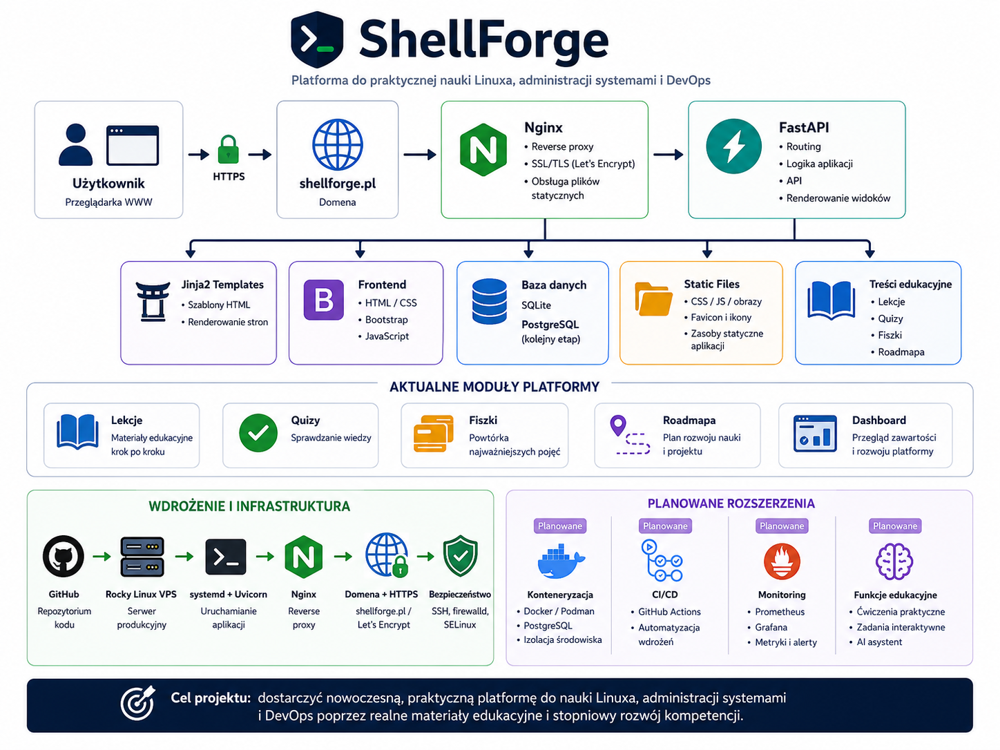

# ShellForge

**ShellForge** to edukacyjna aplikacja webowa do praktycznej nauki Linuxa, administracji systemami oraz podstaw DevOps.

Aplikacja jest dostępna pod adresem:

**https://shellforge.pl**

ShellForge rozwija się jako otwarta platforma edukacyjna, której celem jest stopniowe prowadzenie użytkownika od podstaw pracy w terminalu do zagadnień związanych z administracją serwerem, deploymentem aplikacji, automatyzacją i monitoringiem.

## Cel projektu

Celem ShellForge jest dostarczenie praktycznego środowiska do nauki Linuxa i DevOps poprzez:

- lekcje prowadzone krok po kroku,
- quizy sprawdzające zrozumienie materiału,
- fiszki pomagające utrwalać pojęcia,
- roadmapę rozwoju nauki,
- przykłady oparte na realnych scenariuszach administracyjnych,
- stopniowe przechodzenie od podstaw do bardziej zaawansowanych tematów.

Projekt koncentruje się na praktycznej nauce i zrozumieniu narzędzi, które są wykorzystywane w pracy z systemami Linux, serwerami VPS i aplikacjami webowymi.

## Aktualne funkcje

ShellForge udostępnia obecnie:

- stronę główną opisującą platformę,
- listę lekcji,
- szczegółowe strony lekcji,
- quizy do lekcji,
- fiszki edukacyjne,
- dashboard z podsumowaniem zawartości,
- roadmapę rozwoju platformy,
- publiczne wdrożenie pod domeną `shellforge.pl`,
- HTTPS skonfigurowany przez Let's Encrypt,
- automatyczne testy w GitHub Actions.

## Zakres edukacyjny

Aktualny etap rozwoju skupia się na podstawach Linuxa i pracy w terminalu.

Obecne lekcje obejmują między innymi:

- nawigację po systemie plików,
- pracę z plikami i katalogami,
- uprawnienia plików,
- użytkowników i grupy,
- procesy w Linuxie,
- pracę z plikami tekstowymi,
- pakiety, aktualizacje, `yum`, `rpm` i repozytoria.

Kolejne etapy będą rozwijać tematy administracji systemem, sieci, bezpieczeństwa, deploymentu, konteneryzacji, CI/CD oraz monitoringu.

## Architektura systemu

Poniższy diagram przedstawia ogólną architekturę ShellForge, aktualne moduły platformy oraz planowane kierunki rozwoju.



## Technologie

Projekt wykorzystuje następujące technologie:

- **Python**
- **FastAPI**
- **Uvicorn**
- **Jinja2**
- **HTML / CSS**
- **Bootstrap**
- **JavaScript**
- **SQLite**
- **pytest**
- **GitHub Actions**
- **Rocky Linux**
- **systemd**
- **Nginx**
- **Let's Encrypt / Certbot**

W kolejnych etapach planowane jest rozszerzenie projektu między innymi o PostgreSQL, Docker albo Podman, CI/CD oraz monitoring.

## Struktura aplikacji

Najważniejsze elementy projektu:

```text
app/
├── content/        # treści lekcji, quizów i fiszek
├── routers/        # routing aplikacji FastAPI
├── static/         # pliki CSS, JavaScript i obrazy
├── templates/      # szablony HTML Jinja2
├── database.py     # konfiguracja bazy danych
├── main.py         # główny punkt startowy aplikacji
├── models.py       # modele danych
└── seed.py         # ładowanie treści edukacyjnych do bazy
```

## Dokumentacja

Dodatkowe materiały znajdują się w katalogu `docs/`.

Najważniejsze pliki:

- `docs/deployment.md` — opis ręcznego deploymentu aplikacji na VPS,
- `docs/sources.md` — lista źródeł wykorzystywanych przy tworzeniu materiałów edukacyjnych.

## Roadmapa

Rozwój ShellForge jest podzielony na kilka etapów:

1. **Fundamenty platformy** — podstawowa aplikacja, lekcje, quizy, fiszki, dashboard i testy.
2. **Publiczne uruchomienie** — VPS, Nginx, domena, HTTPS i podstawowa konfiguracja produkcyjna.
3. **Rozbudowa lekcji podstawowych** — dalsze materiały dotyczące pracy z Linuxem.
4. **Administracja systemem** — SSH, firewalld, SELinux, logi i diagnostyka.
5. **Deployment i DevOps** — systemd, Nginx, DNS, HTTPS i aktualizacje aplikacji.
6. **Automatyzacja i monitoring** — konteneryzacja, CI/CD, metryki, alerty i funkcje interaktywne.

Aktualna roadmapa jest dostępna również w aplikacji:

**https://shellforge.pl/roadmap/**

## Źródła materiałów

Materiały edukacyjne są przygotowywane na podstawie dokumentacji i źródeł zebranych w pliku:

```text
docs/sources.md
```

Wśród wykorzystywanych źródeł znajdują się między innymi dokumentacje Rocky Linux, Red Hat Enterprise Linux, Linux man-pages, systemd, OpenSSH, firewalld, SELinux, Nginx, Certbot, Git oraz GitHub Actions.

## Status projektu

ShellForge jest rozwijaną aplikacją edukacyjną. Aktualnie działa publicznie pod domeną `shellforge.pl`, a kolejne etapy rozwoju koncentrują się na rozbudowie materiałów edukacyjnych i stopniowym dodawaniu funkcji wspierających naukę.