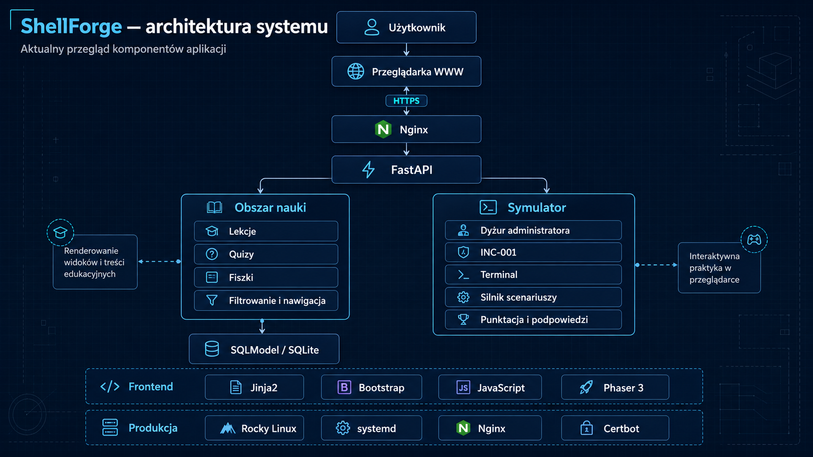

# ShellForge

**ShellForge** to polskojęzyczna platforma do praktycznej nauki Linuxa, administracji systemami, sieci i bezpieczeństwa, wdrażania aplikacji oraz podstaw DevOps.

Aplikacja jest dostępna publicznie pod adresem [shellforge.pl](https://shellforge.pl).

Projekt jest rozwijany jako publiczny projekt edukacyjny i portfolio. Łączy uporządkowane materiały z narzędziami do utrwalania wiedzy oraz interaktywnym trybem rozwiązywania incydentów administracyjnych.

## Trzy filary ShellForge

### 1. Nauka

Lekcje prowadzą krok po kroku od podstaw terminala do zagadnień związanych z utrzymaniem i wdrażaniem aplikacji. Każda lekcja zawiera teorię, praktyczne komendy, zadanie, typowe błędy i podsumowanie.

### 2. Utrwalanie

Quizy pomagają sprawdzić praktyczne zrozumienie materiału, a fiszki wspierają szybką powtórkę komend, pojęć i zależności.

### 3. Praktyka

Symulator „Dyżur administratora” pozwala samodzielnie diagnozować i rozwiązywać incydenty administracyjne w interaktywnym środowisku.

## Najważniejsze funkcje

ShellForge udostępnia obecnie:

- lekcje uporządkowane w moduły tematyczne;
- quizy i fiszki przypisane do lekcji;
- wyszukiwanie oraz filtrowanie lekcji według modułu i poziomu;
- sugerowaną ścieżkę nauki;
- nawigację do poprzedniej i następnej lekcji;
- panel z podsumowaniem materiałów;
- responsywny interfejs oparty na Bootstrapie i dedykowanych stylach;
- Symulator „Dyżur administratora”;
- automatyczne testy i kontrolę jakości kodu uruchamiane w GitHub Actions;
- publiczne wdrożenie z HTTPS.

## Symulator „Dyżur administratora”

Symulator jest interaktywnym trybem praktycznego rozwiązywania incydentów administracyjnych. Dostępny scenariusz **INC-001 „502 po wdrożeniu”** polega na zdiagnozowaniu awarii usługi aplikacyjnej i przywróceniu jej działania.

Scenariusz obejmuje między innymi:

- interakcję ze środowiskiem operacyjnym;
- symulowany terminal administracyjny;
- analizę usług, logów i konfiguracji;
- wykonywanie działań naprawczych;
- cele incydentu i śledzenie postępu;
- punktację premiującą samodzielną diagnostykę;
- stopniowane podpowiedzi;
- pełne rozwiązanie dostępne na żądanie.

Rozwijany tryb Dynamic Incident łączy eksplorowaną mapę 2D Modern NOC z izolowanym środowiskiem Virtual Rocky Linux. Gracz korzysta z monitoringu, racków, Centrum wsparcia i terminala obsługującego kontrolowany katalog realnych składniowo poleceń Linux. Symulacja nigdy nie wykonuje poleceń na hoście aplikacji.

## Zakres edukacyjny

Materiały dostępne w aplikacji obejmują:

- podstawy pracy w terminalu i systemie plików;
- uprawnienia, użytkowników, grupy, procesy i pakiety;
- administrację usługami, logami i zadaniami cyklicznymi;
- diagnostykę systemu i porządkowanie miejsca na dysku;
- adresację IP, DNS i diagnostykę połączeń;
- SSH, firewalld, SELinux oraz podstawy TLS i HTTPS;
- przygotowanie i wdrażanie aplikacji Python;
- Uvicorn, systemd, Nginx, domeny, certyfikaty i aktualizacje aplikacji;
- backup, rollback i diagnostykę problemów po wdrożeniu.

## Architektura

ShellForge jest aplikacją FastAPI renderującą widoki Jinja2 i udostępniającą zasoby statyczne oraz endpointy wykorzystywane przez interaktywny frontend. Dane edukacyjne są synchronizowane z SQLite przez SQLModel podczas startu aplikacji. Symulator stanowi osobny podsystem z routerem, silnikiem scenariusza i obsługą poleceń.



W środowisku produkcyjnym publiczny ruch przechodzi przez Nginx do Uvicorna uruchamiającego aplikację FastAPI. Proces aplikacji jest zarządzany przez systemd, a HTTPS zapewniają certyfikaty Let's Encrypt obsługiwane przez Certbota.

Szczegółowy opis komponentów i przepływów znajduje się w dokumencie [Architektura ShellForge](docs/architecture.md).

## Technologie

### Backend

- Python
- FastAPI
- Uvicorn
- Pydantic

### Frontend

- Jinja2
- HTML
- CSS
- Bootstrap
- JavaScript
- Phaser 3

### Dane

- SQLModel
- SQLite

### Testy / Jakość

- pytest
- Ruff

### CI

- GitHub Actions
- Dependabot

## Praca lokalna

Zależności developerskie, w tym pre-commit, można zainstalować poleceniem:

```powershell
python -m pip install -r requirements-dev.txt
pre-commit install
```

Pełny lokalny quality gate:

```powershell
python scripts/check.py
```

Architektura gameplay, publiczna projekcja mapy i zasady dodawania kolejnych map są opisane w [notatkach developerskich Dynamic Incident](docs/dynamic-incident-development.md).

Smoke test uruchomionej pod adresem `http://127.0.0.1:8000` aplikacji:

```powershell
python scripts/smoke_test.py
```

### Produkcja

- Rocky Linux
- systemd
- Nginx
- Let's Encrypt / Certbot

## Struktura projektu

Najważniejsze elementy repozytorium:

```text
app/
├── admin_duty/
│   ├── scenarios/       # definicje scenariuszy
│   ├── commands.py      # obsługa poleceń Symulatora
│   ├── engine.py        # postęp, punktacja i podpowiedzi
│   └── router.py        # widoki i API Symulatora
├── content/             # treści lekcji, quizów i fiszek
├── routers/             # routery części edukacyjnej
├── static/
│   ├── admin_duty/      # CSS i JavaScript Symulatora
│   └── ...              # wspólne style, skrypty i obrazy
├── templates/
│   ├── admin_duty/      # widoki Symulatora
│   └── ...              # widoki Jinja2 platformy
├── config.py            # konfiguracja aplikacji
├── database.py          # silnik bazy danych i sesje
├── main.py              # konfiguracja FastAPI
├── models.py            # modele SQLModel
└── seed.py              # synchronizacja treści z bazą

docs/                    # dokumentacja projektu
tests/                   # testy pytest
.github/                 # CI i konfiguracja Dependabota
```

## Dokumentacja

- [Architektura systemu](docs/architecture.md)
- [Roadmapa projektu](docs/roadmap.md)
- [Referencyjne wdrożenie na VPS](docs/deployment.md)
- [Źródła materiałów i dokumentacji](docs/sources.md)

Ścieżka nauki jest również dostępna w aplikacji pod adresem [shellforge.pl/roadmap/](https://shellforge.pl/roadmap/).

## Status projektu

ShellForge jest aktywnie rozwijanym projektem edukacyjnym. Obecny kierunek obejmuje dalsze rozwijanie materiałów, praktycznych scenariuszy administracyjnych oraz zagadnień związanych z DevOps, automatyzacją i utrzymaniem systemów.
