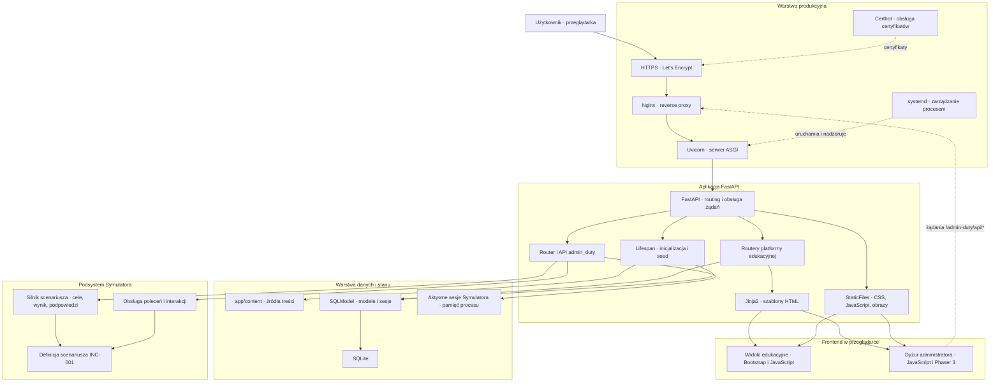

# Architektura ShellForge

Ten dokument opisuje aktualnie istniejącą architekturę ShellForge. Nie jest roadmapą i nie przedstawia planowanych technologii jako elementów działającego systemu.


Grafika przedstawia czytelny przegląd głównych elementów platformy: FastAPI, obszaru nauki, warstwy SQLModel/SQLite, Symulatora, frontendu oraz środowiska produkcyjnego. Diagram Mermaid poniżej uzupełnia ją o techniczny i strukturalny opis przepływów.

## Widok wysokiego poziomu

ShellForge jest aplikacją webową zbudowaną wokół FastAPI. Uvicorn uruchamia aplikację ASGI, FastAPI obsługuje routing i zasoby statyczne, a widoki HTML są renderowane przez Jinja2. Interfejs korzysta z Bootstrapa, dedykowanego CSS i JavaScriptu. Symulator dodatkowo używa Phaser 3.

W aktualnym przepływie aplikacji SQLModel zapewnia dostęp do SQLite. Podczas startu aplikacji tworzone są tabele, a treści z modułów Pythona są synchronizowane z bazą. Routery lekcji, quizów, fiszek i dashboardu odczytują zapisane dane. Stan aktywnych sesji Symulatora jest utrzymywany osobno, w pamięci procesu aplikacji.



## Główne komponenty

### FastAPI i Uvicorn

Punktem wejścia aplikacji jest `app.main:app`. FastAPI:

- rejestruje routery platformy i Symulatora;
- montuje katalog `app/static` pod ścieżką `/static`;
- udostępnia endpoint kontroli działania `/health`;
- obsługuje błędy walidacji i własną stronę 404;
- podczas startu inicjalizuje bazę i synchronizuje treści edukacyjne.

Plik `run.py` uruchamia Uvicorna lokalnie z automatycznym przeładowaniem. W środowisku produkcyjnym Uvicorn powinien być uruchamiany bez `reload` i zarządzany przez systemd.

### Platforma edukacyjna

Routery w `app/routers/` obsługują:

- stronę główną i stronę informacyjną;
- listę i szczegóły lekcji;
- quizy;
- fiszki;
- panel podsumowania;
- ścieżkę nauki;
- endpoint kontroli działania.

Widoki są renderowane przez Jinja2. Lista lekcji jest grupowana według modułów, a filtrowanie w przeglądarce działa po tytule, opisie, poziomie i module. Widok lekcji wyznacza również poprzednią i następną pozycję w uporządkowanej kolekcji.

### Warstwa danych

Modele SQLModel opisują moduły edukacyjne, lekcje, quizy, pytania, odpowiedzi i fiszki. Konfiguracja bazy znajduje się w `app/database.py`, a domyślnym backendem jest SQLite.

Warstwa danych jest elementem aplikacji FastAPI, a nie osobnym wdrożonym serwisem. W aktualnym kodzie korzystają z niej proces inicjalizacji oraz routery odczytujące treści edukacyjne. Symulator ma odrębny mechanizm przechowywania aktywnego stanu i obecnie nie zapisuje sesji scenariusza w SQLite.

### Inicjalizacja i synchronizacja treści

Przy starcie aplikacji wykonywany jest następujący przepływ:

1. FastAPI uruchamia funkcję `lifespan`.
2. SQLModel tworzy brakujące tabele.
3. `app/seed.py` odczytuje struktury z `app/content/`.
4. Moduły, lekcje, quizy i fiszki są synchronizowane z SQLite.
5. Aplikacja zaczyna obsługiwać żądania.

Pliki w `app/content/` są źródłem treści utrzymywanym w repozytorium, natomiast SQLite jest warstwą odczytywaną podczas działania aplikacji.

### Podsystem Symulatora

Kod trybu „Dyżur administratora” znajduje się w `app/admin_duty/` i składa się z:

- `router.py` — widoki scenariusza i endpointy API;
- `engine.py` — cele, postęp, punktacja, podpowiedzi i pełne rozwiązanie;
- `commands.py` — interpretacja obsługiwanych poleceń oraz interakcji;
- `scenarios/incident_001.py` — definicja incydentu INC-001 i jego stan początkowy.

Aktywna sesja otrzymuje identyfikator UUID. Router ogranicza rozmiar danych wejściowych, odrzuca nieznane pola, wygasza nieaktywne sesje i ogranicza ich maksymalną liczbę. Dane sesji są izolowane logicznie i przechowywane w pamięci procesu, a operacje na rejestrze sesji są synchronizowane blokadą.

Konsekwencje obecnego modelu stanu:

- restart procesu usuwa aktywne sesje;
- sesje nie są współdzielone między wieloma procesami Uvicorna;
- SQLite nie jest używane do trwałego zapisu postępu scenariusza.

### Frontend

Wspólny frontend wykorzystuje szablony Jinja2, HTML, Bootstrap, dedykowany CSS i JavaScript. FastAPI udostępnia zasoby z katalogu `app/static`.

Frontend Symulatora rozszerza ten zestaw o Phaser 3. JavaScript steruje interfejsem scenariusza i wysyła żądania do endpointów `/admin-duty/api/*`, między innymi w celu uruchomienia scenariusza, wykonania polecenia, zapisania zmiany, pobrania podpowiedzi i wyświetlenia rozwiązania.

## Przepływ żądania strony edukacyjnej

1. Przeglądarka wysyła żądanie HTTPS.
2. Nginx przekazuje je do Uvicorna nasłuchującego lokalnie.
3. Uvicorn przekazuje żądanie do FastAPI.
4. Router pobiera potrzebne dane przez sesję SQLModel, jeśli dany widok ich wymaga.
5. Jinja2 renderuje szablon HTML.
6. FastAPI zwraca stronę oraz obsługuje żądania o CSS, JavaScript i obrazy pod `/static`.

## Przepływ akcji w Symulatorze

1. Widok scenariusza jest renderowany przez FastAPI i Jinja2.
2. JavaScript w przeglądarce wywołuje odpowiedni endpoint `/admin-duty/api/*`.
3. Router odszukuje aktywną sesję w pamięci procesu.
4. Obsługa poleceń lub silnik scenariusza aktualizuje jego stan.
5. API zwraca wynik działania i aktualny postęp.
6. Frontend aktualizuje terminal, elementy środowiska, cele i punktację.

## Przepływ produkcyjny

Udokumentowany model wdrożenia wygląda następująco:

```text
Internet
  → HTTPS
  → Nginx
  → Uvicorn na 127.0.0.1
  → FastAPI
```

Systemd uruchamia i nadzoruje proces Uvicorna. Nginx pełni rolę publicznego reverse proxy, a Certbot obsługuje certyfikaty Let's Encrypt.

Repozytorium nie zawiera rzeczywistych plików jednostki systemd ani konfiguracji Nginx, firewalld, SELinux lub Certbota. Dokumentacja opisuje więc potwierdzony model aplikacji i referencyjną topologię wdrożenia, ale nie stanowi audytu konfiguracji działającego VPS-a.

## Granice aktualnej architektury

W aktualnym repozytorium nie ma implementacji PostgreSQL, kontenerów Docker lub Podman, WebSocketów, zewnętrznego magazynu sesji Symulatora, Prometheusa, Grafany ani systemu AI. Elementy te nie są częścią powyższego diagramu.

## Grafika i diagram techniczny

Grafika PNG pełni rolę czytelnej wizualizacji architektury dla użytkownika. Diagram Mermaid pozostaje technicznym opisem komponentów, zależności i przepływów aktualnej aplikacji.
